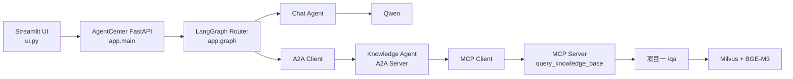

# AgentCenter

AgentCenter是一个基于FastAPI、LangGraph、A2A和MCP的智能路由协同项目。它把普通聊天与项目一“编程面试知识库助手”连接到同一个入口，并通过标准协议保持Agent与工具之间的职责边界。

## 核心能力

- LangGraph维护会话State，并通过Router在Chat和Knowledge路线之间分流。
- Router优先使用Qwen结构化输出，模型不可用时回退到确定性规则。
- Chat Agent直接调用Qwen生成回答。
- AgentCenter通过A2A Client发现并调用独立Knowledge Agent。
- Knowledge Agent通过stdio MCP Client发现并调用`query_knowledge_base`工具。
- MCP Server通过HTTP调用项目一RAG服务，不复制Milvus、BGE-M3或检索代码。
- 使用`thread_id`和`InMemorySaver`维护同一进程内的多轮上下文。
- 同时提供普通HTTP接口和SSE流式接口。
- 提供最小Streamlit页面，展示路由结果、回答来源和流式内容。
- 项目一不可用时返回`RAG_UNAVAILABLE`，Chat路线仍保持可用。

## 系统结构



Knowledge完整调用链：

```text
用户问题
→ AgentCenter /chat或/chat/stream
→ LangGraph Router
→ A2A Client读取Agent Card并发送Message/Task
→ Knowledge Agent
→ MCP Client初始化、发现并调用query_knowledge_base
→ MCP Server
→ 项目一POST /qa
→ 返回answer与source
```

## 目录

```text
AgentCenter/
├─ app/
│  ├─ main.py               # AgentCenter FastAPI入口与SSE契约
│  ├─ graph.py              # LangGraph State、Router与双Agent路线
│  ├─ knowledge_agent.py    # 独立A2A Knowledge Agent服务
│  ├─ a2a_client.py         # 主图使用的A2A Client
│  ├─ mcp_server.py         # query_knowledge_base MCP工具
│  ├─ mcp_client.py         # Knowledge Agent使用的stdio MCP Client
│  ├─ rag_client.py         # 项目一RAG HTTP适配器
│  ├─ model_provider.py     # Qwen客户端延迟创建与复用
│  ├─ schemas.py            # 跨层请求、响应和结果契约
│  ├─ api_client.py         # Streamlit访问SSE接口的客户端
│  └─ config.py             # 环境变量与服务地址
├─ tests/                   # Router、API、SSE、MCP与A2A测试
├─ scripts/e2e_check.py     # 三个后端服务启动后的真实全链路检查
├─ ui.py                    # Streamlit展示页面
├─ .env.example             # 可公开配置模板
├─ requirements.txt
└─ requirements-dev.txt
```

## 环境配置

推荐Python 3.14。创建环境并安装依赖：

```powershell
python -m venv .venv
.\.venv\Scripts\Activate.ps1
python -m pip install -r requirements-dev.txt
```

复制配置模板：

```powershell
Copy-Item .env.example .env
```

至少填写：

```dotenv
DASHSCOPE_API_KEY=你的百炼API_Key
```

真实`.env`已被`.gitignore`排除，不能提交到Git。

## 启动顺序

### 1. 启动项目一RAG服务

在“编程面试八股文助手”目录运行：

```powershell
.\.venv\Scripts\Activate.ps1
python -m uvicorn api:app --host 127.0.0.1 --port 8000
```

### 2. 启动Knowledge Agent

在AgentCenter目录运行：

```powershell
.\.venv\Scripts\Activate.ps1
python -m uvicorn app.knowledge_agent:app --host 127.0.0.1 --port 8200
```

Knowledge Agent首次处理任务时会自动启动stdio MCP Server，不需要再手动打开一个MCP终端。

### 3. 启动AgentCenter

```powershell
python -m uvicorn app.main:app --host 127.0.0.1 --port 8100
```

### 4. 启动展示页面

```powershell
python -m streamlit run ui.py --server.port 8502
```

访问地址：

- Streamlit：<http://127.0.0.1:8502>
- AgentCenter文档：<http://127.0.0.1:8100/docs>
- Knowledge Agent文档：<http://127.0.0.1:8200/docs>
- A2A Agent Card：<http://127.0.0.1:8200/.well-known/agent-card.json>

## API

### 健康检查

```http
GET /health
```

### 普通问答

```http
POST /chat
Content-Type: application/json
```

```json
{
  "thread_id": "demo-001",
  "message": "什么是RAG？"
}
```

响应：

```json
{
  "intent": "knowledge",
  "response": "回答内容",
  "source": "RAG",
  "thread_id": "demo-001"
}
```

### SSE流式问答

```http
POST /chat/stream
```

事件顺序：

```text
start
→ route
→ token（Chat流式内容）或message（Knowledge完整结果）
→ done
```

异常时返回`error`。`done`中包含最终`intent`、`source`和是否产生流式token。

## 测试

自动化测试：

```powershell
python -m pytest -q
```

在项目一、Knowledge Agent和AgentCenter均已启动后，执行真实全链路检查：

```powershell
python -m scripts.e2e_check
```

当前测试覆盖：

- Router回退与双路线选择。
- 同一`thread_id`先Knowledge后Chat时的`source`重置。
- `/health`、`/chat`和请求校验。
- SSE事件契约。
- MCP初始化、工具发现和调用。
- A2A Agent Card、Message、Task和结果返回。
- 项目一真实RAG响应、Knowledge路线、Chat路线和流式输出。
- Streamlit页面启动与初始渲染。

## 能力边界

- 会话使用`InMemorySaver`，服务重启后不会保留。
- 当前只有Knowledge Agent通过A2A独立服务化，未实现复杂任务规划和Agent自动扩缩容。
- MCP当前只暴露项目一知识库工具，不代表已经具备通用工具市场。
- 未实现Gateway、JWT鉴权、Nacos、生产级监控、Docker部署和多用户权限。
- 当前是个人学习与展示项目，不等同于生产级多智能体平台。
