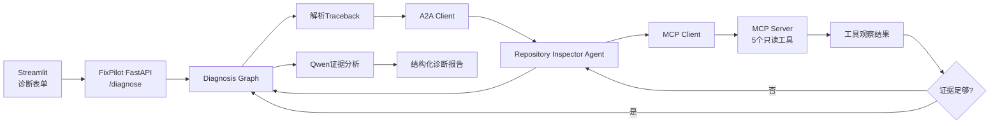

# FixPilot

FixPilot是一个面向Python/AI应用项目的智能故障诊断系统。用户提交报错、
Traceback和可选仓库路径后，系统通过LangGraph组织诊断流程，通过A2A调用独立的
Repository Inspector Agent。该Agent会根据当前观察自主选择MCP只读工具、检查结果后
继续取证或停止，最终由主流程生成带证据引用、根因候选、解决步骤和验证步骤的结构化
诊断报告。

FixPilot的最终产品边界是只读诊断：系统不会修改目标项目，也不会执行任意Shell命令。
它包含一个通过A2A提供服务的专项Agent，不宣称是多Agent系统或Agent中心。

## 核心能力

- 确定性解析Python Traceback，提取异常类型、消息、调用帧和代码搜索词。
- 使用LangGraph执行“解析 → 取证 → 分析 → 报告”四节点工作流。
- 通过A2A协议调用独立Repository Inspector Agent。
- Inspector Agent先完成仓库安全预检，再在其余MCP工具中自主选择下一步、观察结果并
  决定停止；最大步数、重复调用拦截和参数限制负责约束循环。
- Inspector决策模型不可用时回到固定只读取证流程，主诊断链仍可继续。
- 使用Qwen根据真实证据生成最多三个根因候选；模型不可用时保留规则降级报告。
- 输出工具取证轨迹、稳定根因类别、证据ID、可信度、推荐处理、验证步骤和未确定项。
- FastAPI同时提供普通诊断接口和SSE进度接口。
- Streamlit提供结构化诊断表单与报告页面。
- 使用工作区白名单、路径归一化、敏感文件拒绝、文件大小限制和密钥脱敏控制读取风险。

## 系统结构



完整主链：

```text
用户输入报错和可选仓库路径
→ POST /diagnose 或 /diagnose/stream
→ parse_traceback：结构化异常
→ collect_evidence：A2A调用Repository Inspector Agent
→ MCP Client自动启动stdio MCP Server
→ 程序执行目录安全预检
→ Inspector根据当前观察选择搜索、源码、依赖或环境工具
→ 读取工具结果后继续选择或主动停止
→ analyze：Qwen基于证据生成根因候选
→ build_report：过滤无效证据引用并生成稳定报告
→ FastAPI或Streamlit展示
```

## 安全边界

MCP Server只暴露：

1. `list_project_files`
2. `read_source_file`
3. `search_code`
4. `read_dependency_manifest`
5. `get_python_environment`

安全限制：

- 仓库必须位于`FIXPILOT_WORKSPACE_ROOTS`白名单中。
- 所有路径都会解析为绝对路径并阻止`..`逃逸。
- 默认忽略`.git`、`.venv`、`node_modules`、缓存、构建目录和模型目录。
- 默认拒绝`.env`、证书、私钥和凭据文件。
- 只允许读取常见Python项目文本文件，并限制单文件大小和扫描文件总数。
- 跳过符号链接，防止链接目标绕出仓库和工作区白名单。
- 证据中的常见API Key、Token、密码和Secret会被替换为`[REDACTED]`。
- 进入模型的证据有总字符预算，仓库文本一律按不可信数据处理，不能覆盖系统指令。
- 不提供文件写入、文件删除或任意命令执行工具。

## 目录

```text
AgentCenter/                  # 当前本地目录仍保留历史名称
├─ app/
│  ├─ main.py                # FixPilot FastAPI与SSE入口
│  ├─ graph.py               # 四节点Diagnosis Graph
│  ├─ traceback_parser.py    # 确定性Traceback解析
│  ├─ inspector_client.py    # 主Graph使用的A2A Client
│  ├─ inspector_agent.py     # 独立Repository Inspector Agent
│  ├─ repository_inspector.py # 受限工具决策循环与固定降级
│  ├─ mcp_client.py          # 只负责stdio MCP连接与工具执行
│  ├─ mcp_server.py          # 五个只读MCP工具
│  ├─ workspace.py           # 仓库读取、安全策略与脱敏
│  ├─ model_provider.py      # Qwen诊断模型延迟创建与复用
│  ├─ schemas.py             # 输入、证据和报告数据契约
│  ├─ api_client.py          # Streamlit SSE客户端
│  └─ config.py              # 环境变量与安全配置
├─ tests/
│  ├─ fixtures/              # 六个已知根因案例
│  └─ test_*.py              # API、Graph、A2A、MCP、安全与页面测试
├─ scripts/e2e_check.py      # 真实A2A、MCP、Qwen和SSE检查
├─ ui.py                     # Streamlit诊断页面
├─ .env.example              # 可公开配置模板
├─ requirements.txt
└─ requirements-dev.txt
```

## 环境配置

推荐Python 3.14：

```powershell
python -m venv .venv
.\.venv\Scripts\Activate.ps1
python -m pip install -r requirements-dev.txt
Copy-Item .env.example .env
```

至少配置：

```dotenv
DASHSCOPE_API_KEY=你的百炼API_Key
FIXPILOT_WORKSPACE_ROOTS=D:\允许诊断的项目父目录
```

Windows允许多个父目录时使用分号分隔。留空时默认只允许当前项目目录所在的父目录。
真实`.env`已由`.gitignore`排除，禁止提交。

## 启动顺序

### 1. Repository Inspector Agent

```powershell
python -m uvicorn app.inspector_agent:app --host 127.0.0.1 --port 8200
```

首次检查仓库时会自动启动stdio MCP Server，不需要单独打开MCP终端。

### 2. FixPilot API

```powershell
python -m uvicorn app.main:app --host 127.0.0.1 --port 8100
```

### 3. Streamlit

```powershell
python -m streamlit run ui.py --server.port 8502
```

访问：

- Streamlit：<http://127.0.0.1:8502>
- FixPilot API文档：<http://127.0.0.1:8100/docs>
- Inspector Agent Card：<http://127.0.0.1:8200/.well-known/agent-card.json>

FixPilot已经与项目一RAG完全解耦，运行时不需要启动项目一。

## API

普通诊断：

```http
POST /diagnose
Content-Type: application/json
```

```json
{
  "traceback": "ModuleNotFoundError: No module named 'pymilvus'",
  "repository_path": "D:\\path\\to\\python-project",
  "command": "python app.py",
  "expected_behavior": "服务应正常启动",
  "python_version": "3.14"
}
```

除`traceback`外，其余字段均可选。无仓库路径时，系统只使用报错和用户粘贴的
依赖、代码上下文生成报告。

流式诊断：

```http
POST /diagnose/stream
```

SSE事件：

```text
start
→ stage（共四个Graph节点）
→ report
→ done
```

异常时返回`error`事件。

## 测试与验证

运行全部自动化测试：

```powershell
python -m pytest -q
```

覆盖：

- Traceback结构化解析。
- Diagnosis Graph与规则降级。
- `/health`、`/diagnose`、参数校验和SSE契约。
- A2A Agent Card、Message、Task和结果返回。
- Inspector动态选择工具、主动停止、重复调用拦截、步数上限和固定降级。
- MCP五工具发现与真实stdio调用。
- 路径白名单、路径逃逸、敏感文件拒绝、密钥脱敏。
- 六个已知根因案例。
- Streamlit初始页面渲染。

启动Inspector Agent与FixPilot API后执行真实全链路检查：

```powershell
python -m scripts.e2e_check
```

真实E2E要求A2A、Inspector自主取证、MCP、仓库读取、Qwen诊断和SSE全部成功，
不接受Inspector固定降级或诊断模型规则降级。

批量评估六个固定案例：

```powershell
python -m scripts.evaluate_cases
```

脚本检查每个已知根因类别是否进入模型返回的前三个候选，并输出`top3_recall`。

六类固定案例：

1. 缺少Python模块。
2. 包版本或导入API不兼容。
3. 环境变量或API Key缺失。
4. 外部服务连接失败。
5. Milvus本地数据库锁冲突。
6. 嵌套异步事件循环。

## 输出边界

- 根因候选是基于当前证据的诊断结论，不等于已经执行修复。
- `evidence`来自Traceback、用户上下文或只读仓库检查；模型不得伪造证据ID。
- 环境工具报告的是FixPilot运行环境，不一定等于目标仓库的独立虚拟环境。
- 不自动联网搜索官方文档或GitHub Issue。
- 不修改代码、不运行目标项目测试、不执行修复命令，也不提供自动回退。
- 当前只面向Python/AI应用项目，不承诺Java、前端或通用操作系统故障诊断。

## 最终范围

FixPilot以“一个远程专项Agent完成只读诊断”为最终产品形态。A2A负责主诊断流程与
独立Inspector Agent之间的标准Agent通信；MCP负责Inspector内部工具接入；真正的
工具选择、观察和停止发生在Inspector受限循环中。

本项目不再规划自动修复、额外Agent、持久化诊断状态、外部RAG、Docker、Gateway、
Nacos、Java支持或复杂生产治理。后续只处理真实缺陷、测试、文档和不改变主链的小型
交付调整。

## 重构说明

本项目由AgentCenter完成版继续重构，保留了FastAPI、LangGraph、A2A、MCP、SSE和
分层测试基础，但已经移除Chat/Knowledge双路由、Knowledge Agent和项目一RAG运行
依赖。旧完成版保留在Git历史提交`aca48b6`，不会与FixPilot的新业务能力混写。
