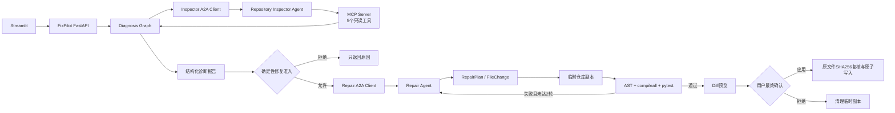
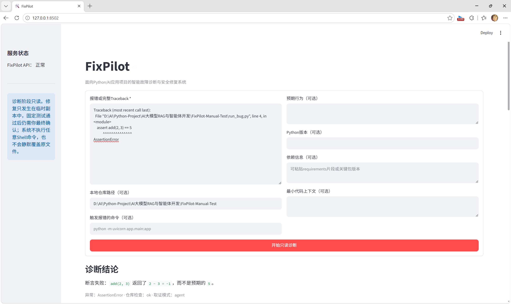
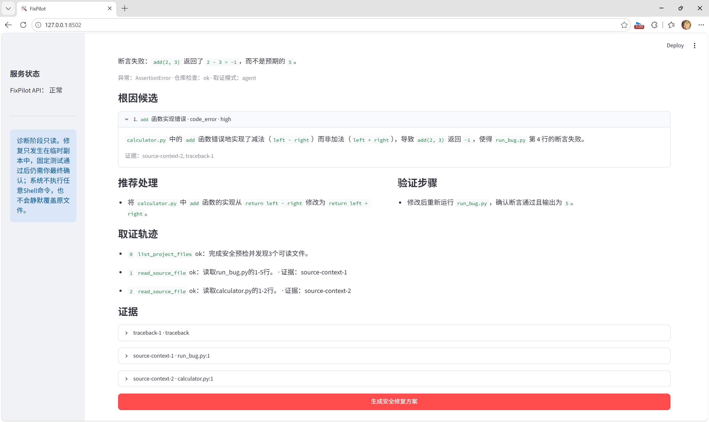
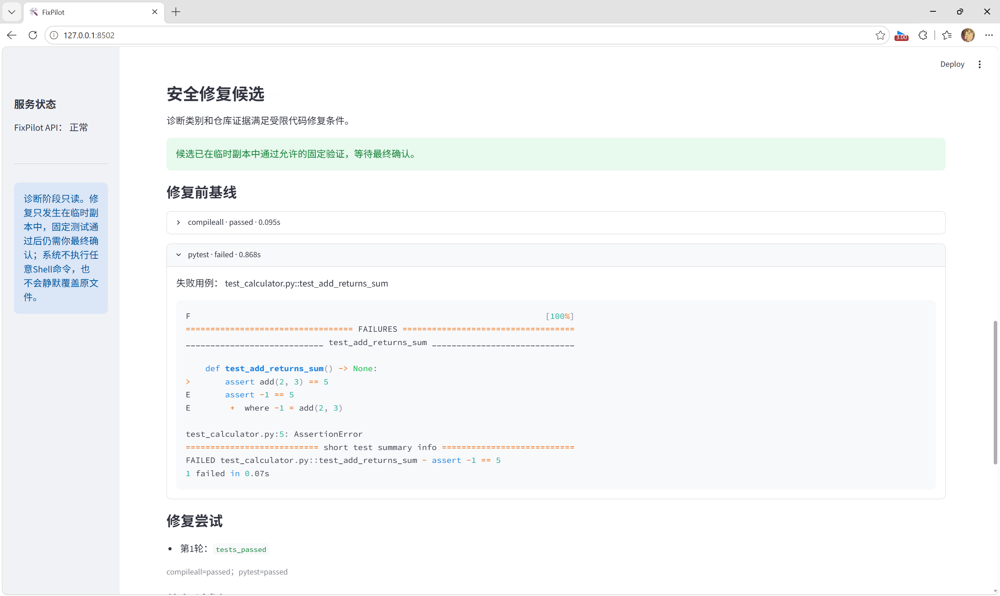
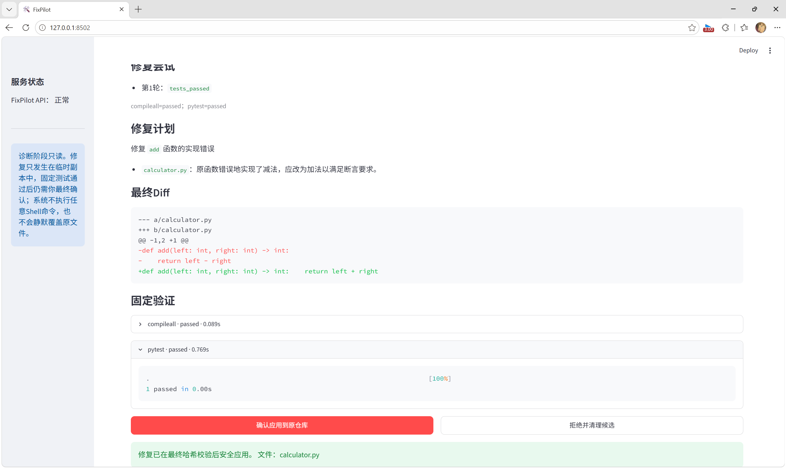

# FixPilot

FixPilot是一个面向Python/AI应用项目的多Agent故障诊断与安全修复系统。用户提交
Traceback和目标仓库后，主编排器先通过A2A调用Repository Inspector Agent完成只读
取证，再生成结构化诊断报告；只有确定性策略判定适合修改代码时，才允许用户发起
Repair Agent。修复始终先发生在隔离临时副本中，固定测试通过后展示Diff，最终由用户
确认是否应用到原仓库。

系统采用“稳定工作流包住受限Agent”的混合架构：编排器决定诊断、修复、测试和确认
阶段；两个专项Agent分别决定如何收集证据、如何根据诊断和测试反馈生成文件修改。
A2A统一两个远程Agent的发现、消息、任务和Artifact契约，MCP只用于Inspector内部接入
五个只读仓库工具。

## 核心能力

- 确定性解析Python Traceback，提取异常类型、消息、调用帧和搜索词。
- LangGraph执行“解析 → 取证 → 分析 → 报告”四节点诊断工作流。
- 通过A2A调用独立Repository Inspector Agent和Repair Agent。
- Inspector根据当前观察自主选择MCP只读工具，并受步数、重复调用和字符预算约束。
- Qwen只根据真实证据生成最多三个根因候选，输出稳定证据ID和根因类别。
- 确定性修复准入策略拒绝配置缺失、外部服务不可用、资源锁和证据不足等问题。
- Repair Agent内部先生成精确旧文本→新文本替换，由程序物化为冻结的
  `RepairPlan / FileChange`完整文件契约，最多修改三个现有文件。
- 修复在普通临时副本中执行，先做AST语法校验，再运行固定`compileall`与`pytest -q`。
- 修复前基线测试参与候选比较；每轮明确记录已修复、仍失败和新增失败用例，
  没有改善或相对最佳候选发生倒退时自动撤销本轮。
- 测试失败时最多向Repair Agent反馈一次，第二轮基于当前副本继续；若新增失败用例，
  自动撤销第二轮并保留上一候选。
- 生成统一Diff；最终落盘前重新校验原文件SHA256，并以原子写入和失败回滚保护多文件修改。
- FastAPI提供诊断SSE与修复生成、应用、拒绝接口；Streamlit保存最小页面状态并展示全过程。
- 模型或Agent不可用时诊断链可降级；修复链采用失败关闭，不会绕过测试或自动修改原仓库。

## 系统结构



完整调用链：

```text
用户提交报错和仓库路径
→ POST /diagnose 或 /diagnose/stream
→ Diagnosis Graph解析Traceback
→ A2A调用Inspector Agent
→ Inspector按观察选择MCP只读工具并返回证据
→ Qwen生成证据驱动诊断报告
→ 用户点击“生成安全修复方案”
→ 确定性策略判断是否适合代码修复
→ 创建普通临时副本并运行修复前固定测试
→ A2A调用Repair Agent生成结构化FileChange
→ 安全校验后只写临时副本
→ AST、compileall、pytest固定验证
→ 失败时最多反馈一轮；成功后展示最终Diff
→ 用户确认应用或拒绝
→ 应用前复核原文件哈希，原子写入；拒绝则清理副本
```

## 人工验收案例

提交前使用独立Python仓库完成了一次真实人工验收：先在PyCharm运行错误程序并取得
英文`AssertionError`，再由FixPilot读取目标仓库、定位`calculator.py`中的实现错误，
在临时副本中生成修复并运行固定测试，最后由用户确认写回原文件。

验收结果：

- Inspector Agent通过MCP只读工具找到`run_bug.py`与`calculator.py`，根因类别为`code_error`。
- 修复前基线为`compileall=passed`、`pytest=failed`，失败用例为`test_add_returns_sum`。
- Repair Agent第1轮生成候选后，`compileall`与`pytest`全部通过。
- 页面展示最终Diff；用户确认后再次校验源文件哈希，并安全写回`calculator.py`。

<details>
<summary>1. 真实Traceback与诊断结论</summary>



</details>

<details>
<summary>2. Inspector取证轨迹与根因定位</summary>



</details>

<details>
<summary>3. 修复前基线与候选测试</summary>



</details>

<details open>
<summary>4. 最终Diff、固定验证与人工确认写回</summary>



</details>

## 目录

```text
AgentCenter/                   # 本地目录保留历史名称，产品名为FixPilot
├─ app/
│  ├─ main.py                 # FastAPI、SSE与修复两阶段接口
│  ├─ graph.py                # 四节点Diagnosis Graph
│  ├─ traceback_parser.py     # 确定性Traceback解析
│  ├─ inspector_client.py     # Inspector A2A Client
│  ├─ inspector_agent.py      # Repository Inspector Agent服务
│  ├─ repository_inspector.py # Inspector受限工具决策循环
│  ├─ mcp_client.py           # stdio MCP连接
│  ├─ mcp_server.py           # 五个只读MCP工具
│  ├─ workspace.py            # 只读仓库安全策略与脱敏
│  ├─ repair_client.py        # Repair A2A Client
│  ├─ repair_agent.py         # Repair Agent服务与结构化生成
│  ├─ repair_service.py       # 修复准入、两轮编排、内存会话与人工确认
│  ├─ repair_workspace.py     # 临时副本、写入、测试、Diff、哈希与回滚
│  ├─ model_provider.py       # Qwen模型延迟创建与结构化输出
│  ├─ schemas.py              # 诊断与修复的Pydantic契约
│  ├─ api_client.py           # Streamlit访问FastAPI的客户端
│  └─ config.py               # 服务地址、安全上限与环境变量
├─ tests/
│  ├─ fixtures/diagnostic_cases.json # 六个诊断与修复准入案例
│  └─ test_*.py               # Graph、Agent、协议、管道、安全、API与UI测试
├─ scripts/
│  ├─ e2e_check.py            # 真实只读诊断链检查
│  ├─ repair_e2e_check.py     # 真实双Agent修复和安全落盘检查
│  ├─ evaluate_cases.py       # 六案例诊断Top 3评估
│  └─ evaluate_repair_policy.py # 六案例修复准入评估
├─ ui.py                      # Streamlit诊断、Diff和人工确认页面
├─ .env.example               # 可公开配置模板
├─ requirements.txt
└─ requirements-dev.txt
```

## 安全边界

### Inspector只读边界

MCP Server只暴露：

1. `list_project_files`
2. `read_source_file`
3. `search_code`
4. `read_dependency_manifest`
5. `get_python_environment`

仓库必须位于`FIXPILOT_WORKSPACE_ROOTS`白名单内；系统阻止`..`路径逃逸、跳过
符号链接、虚拟环境、缓存、构建目录和模型目录，拒绝`.env`、私钥和凭据文件，并对
证据中的常见密钥、Token和密码脱敏。

### Repair写入与执行边界

- Repair Agent只能读取FixPilot创建的临时副本，不能直接访问原仓库写接口。
- 只允许修改最多三个已存在的Python源码或`requirements*.txt`，不创建、不删除文件。
- 禁止修改`tests/`、`test_*.py`和`conftest.py`，避免通过降低断言伪造成功。
- 禁止写入`.env`、凭据、证书、私钥和疑似明文密钥。
- Python内容先通过AST语法校验，结构或哈希不合法的计划不会写入副本。
- 不接受用户或模型提供的任意命令；只用当前Python解释器执行固定参数数组：
  `python -m compileall -q .`和`python -m pytest -q`，`shell=False`并带超时。
- pytest完整输出保留在本轮结果中，模型只接收退出码、失败用例和受预算约束的首尾日志。
- 没有pytest用例时只标记“语法检查通过”，不会宣传业务功能已经验证。
- 用户点击生成只授权临时副本修复；只有最后点击确认才允许写原仓库。
- 最终写入前复核初始SHA256；用户或IDE已经修改过原文件时拒绝覆盖。
- 等待确认的修复状态只保存在内存中，默认30分钟过期；服务重启后候选失效。

## 环境配置

推荐Python 3.14：

```powershell
python -m venv .venv
.\.venv\Scripts\Activate.ps1
python -m pip install -r requirements-dev.txt
Copy-Item .env.example .env
```

至少配置：

```dotenv
DASHSCOPE_API_KEY=你的百炼API_Key
FIXPILOT_WORKSPACE_ROOTS=D:\允许诊断和修复的项目父目录
```

Windows配置多个白名单父目录时使用分号分隔。`FIXPILOT_REPAIR_TEMP_ROOT`留空时使用
Windows临时目录下的`fixpilot-repairs`。真实`.env`已被Git忽略，禁止提交。

## 启动顺序

### 1. Repository Inspector Agent（8200）

```powershell
python -m uvicorn app.inspector_agent:app --host 127.0.0.1 --port 8200
```

Inspector启动时自动连接stdio MCP Server，不需要单独打开MCP终端。

### 2. Repair Agent（8300）

```powershell
python -m uvicorn app.repair_agent:app --host 127.0.0.1 --port 8300
```

### 3. FixPilot API（8100）

```powershell
python -m uvicorn app.main:app --host 127.0.0.1 --port 8100
```

### 4. Streamlit（8502）

```powershell
python -m streamlit run ui.py --server.port 8502
```

访问：

- Streamlit：<http://127.0.0.1:8502>
- API文档：<http://127.0.0.1:8100/docs>
- Inspector Agent Card：<http://127.0.0.1:8200/.well-known/agent-card.json>
- Repair Agent Card：<http://127.0.0.1:8300/.well-known/agent-card.json>

## API

诊断接口：

```text
GET  /health
POST /diagnose
POST /diagnose/stream
```

`/diagnose/stream`的SSE事件为：

```text
start → stage × 4 → report → done
```

修复采用普通两阶段HTTP接口，不使用LangGraph中断恢复：

```text
POST /repair/generate  # 生成、临时写入、固定测试，返回repair_id和Diff
POST /repair/apply     # 最终人工确认后安全落盘
POST /repair/reject    # 拒绝并清理临时副本
```

生成请求：

```json
{
  "repository_path": "D:\\path\\to\\python-project",
  "report": {"diagnosis_id": "...", "summary": "..."}
}
```

真实请求中的`report`是`/diagnose`返回的完整`DiagnosisReport`，不是只发送示例字段。

## 测试与验证

全部自动化测试：

```powershell
python -m pytest -q
python -m compileall -q app scripts tests ui.py
python -m pip check
git diff --check
```

测试覆盖：

- Traceback、Diagnosis Graph、诊断降级和六类根因。
- Inspector与Repair两个Agent Card、A2A Message/Task/Artifact。
- Inspector工具选择、停止、重复拦截、步数上限和MCP固定降级。
- 工作区白名单、路径逃逸、敏感文件、脱敏和只读工具。
- `RepairPlan`哈希、最多三文件、禁止改测试、AST校验和秘密拦截。
- 三个已知答案在中文路径中跑通“失败 → 临时修复 → 测试 → Diff → 落盘”。
- Repair Agent第一轮失败、第二轮成功，基线/候选差异计算，以及无改善或第二轮
  测试倒退自动撤销。
- 原文件外部变化后的哈希冲突拒绝、多文件安全写入和失败候选不可应用。
- FastAPI诊断与修复契约、SSE和Streamlit初始页面。

启动三个后端服务后执行真实链路：

```powershell
python -m scripts.e2e_check
python -m scripts.repair_e2e_check
python -m scripts.evaluate_cases
python -m scripts.evaluate_repair_policy
```

`repair_e2e_check`要求真实Qwen、两个A2A Agent、Inspector MCP取证、Repair反馈、临时
测试、确认前原仓库不变、最终哈希落盘和落盘后pytest全部成功。

## 能力边界

- 只面向Python/AI应用项目，不承诺Java或多语言自动修复。
- Repair Agent输出的是受限候选，不保证所有错误都能在两轮内修复。
- 配置、网络服务、数据库锁、权限和证据不足等问题默认只诊断，不自动改代码。
- 不安装依赖、不访问任意Shell、不创建/删除文件、不修改测试，不自动提交Git或创建PR。
- 不使用Docker沙箱、Git worktree、可执行Patch、持久化数据库或独立Verifier Agent。
- 不包含Gateway、Nacos、生产级鉴权、分布式治理或多用户权限系统。
- 修复前已经通过的测试只能证明候选没有破坏现有测试，不能单独证明原始运行错误消失。
- 六案例与真实E2E用于证明链路可评估，不代表生产环境修复成功率。

## 版本演进

本项目由AgentCenter完成版继续重构：旧版保存在标签`agentcenter-v1`；只读诊断稳定版
保存在标签`fixpilot-diagnosis-v1`。当前分支在该稳定版之上增加Inspector与Repair双Agent
协作、安全临时修复、固定验证和最终人工确认，不再规划改变项目身份或扩张为通用自治
开发平台。
